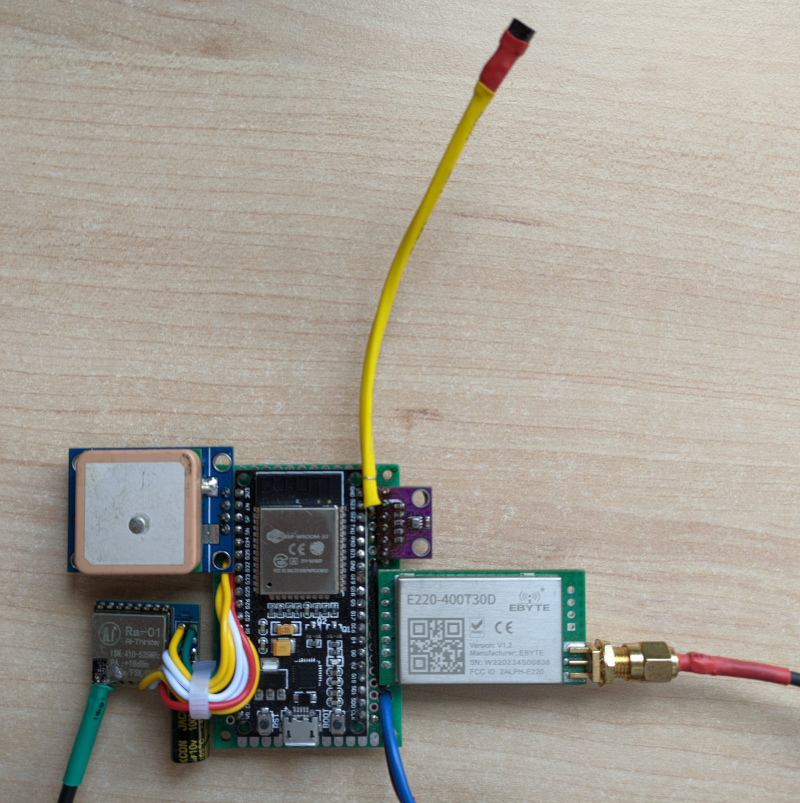

# Air station

The air station includes an internal temperature and pressure sensor(BMP280) and an external temperatute sensor(DS18B20) connected by I2C and 1-Wire interfaces to the main controller(ESP32). Position of the balloon received from GPS module(NEO-6M) via UART interface. It is not recommended to use NEO-6M module without reconfiguration, because with the default settings it looses position at high altitude, ATGM336H is highly recommended instead.
Telemetry delivered in two ways: 
* By RTTY transmission to HabHub high altitude balloons tracking system at 437.600MHz. During the launch about 5 HabHub stations were receiving the signal and sending the data to tracker.habhub.org website. Ra-01 SX1278 module is used for this purpose.
* By LoRa transmission to the ground station at 434.125MHz. The ground station displays the current position, temperature, altitude and saves historical data to internal memory. 433T30D (SX1278 + mcu and amplifier) module is used for LoRa transmission.

