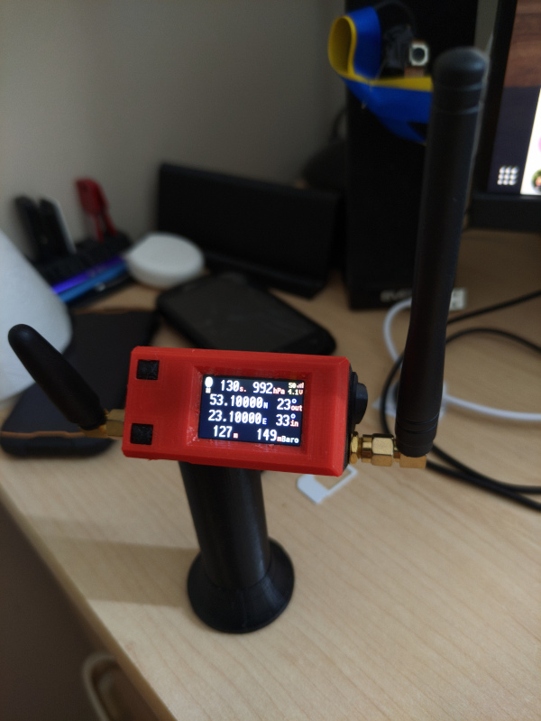

# Ground station

The ground station is based on TTGO T-Display RP2040 board, programmed with embedded Python and powered by a single 18650 Li-pol battery. Ground station's LoRa receiver module (433T30D) is based on SX1278 chip and communicates with the controller by UART.
Initially it was planned to add a GSM module to the ground station, but GSM created some interferences with RP2040 that caused its reset. The front panel of the station was taken from https://www.thingiverse.com/thing:4501444 and the main body with the battery bay was created in FreeCAD (sources and models are in Case folder).
All received packets are saved to FlyLog.txt file for the future processing.

