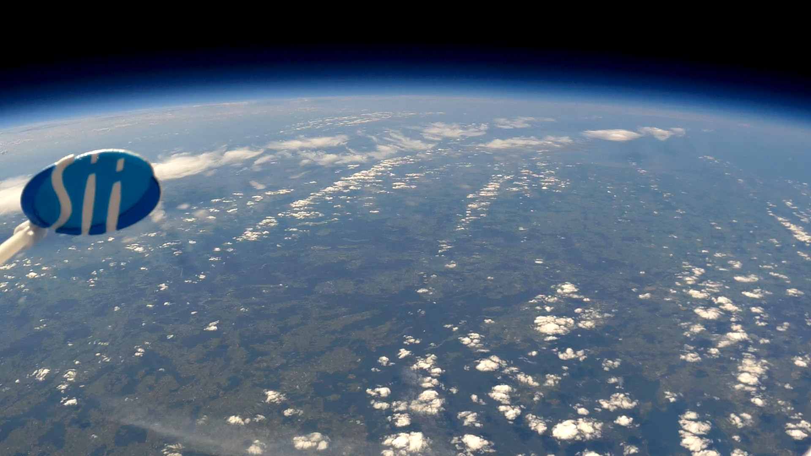
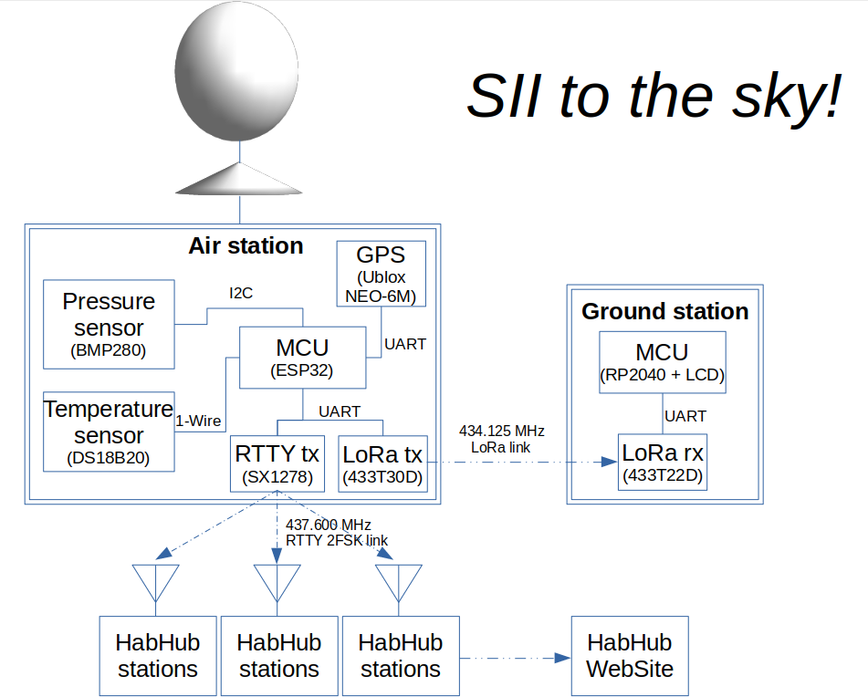
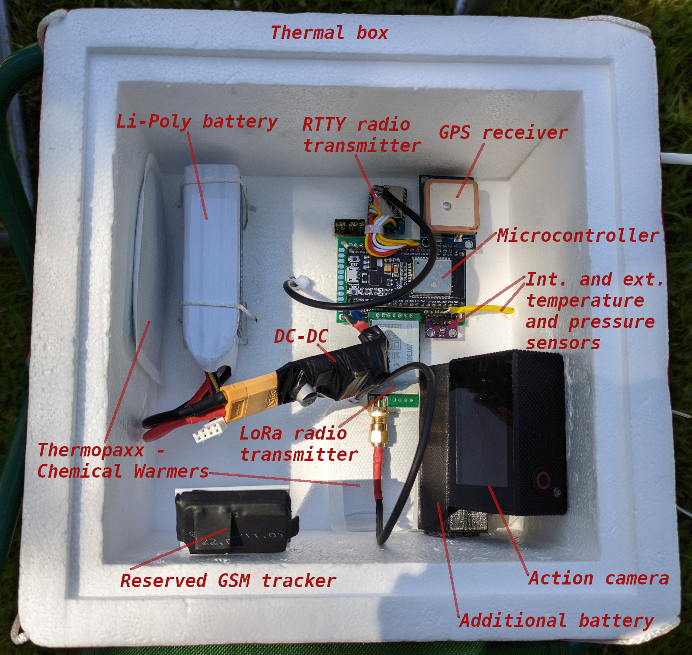
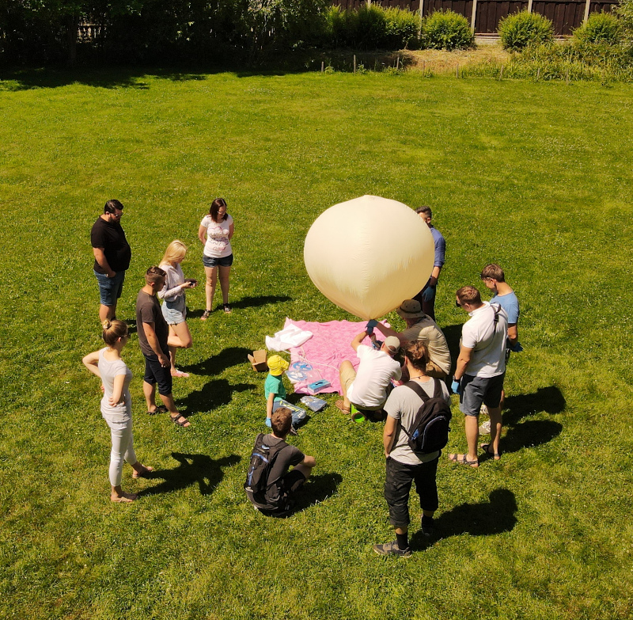
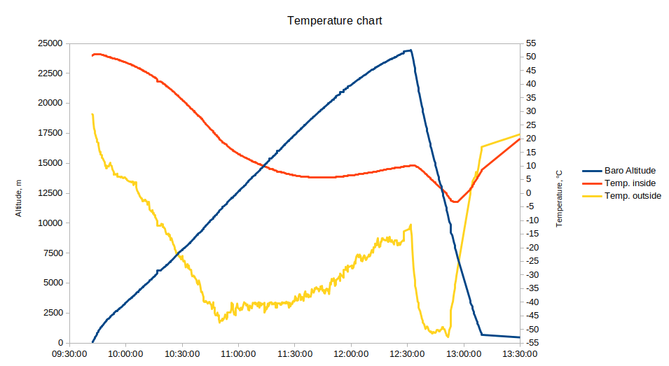
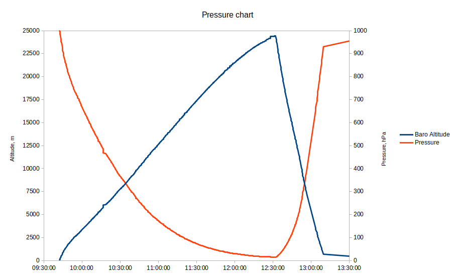
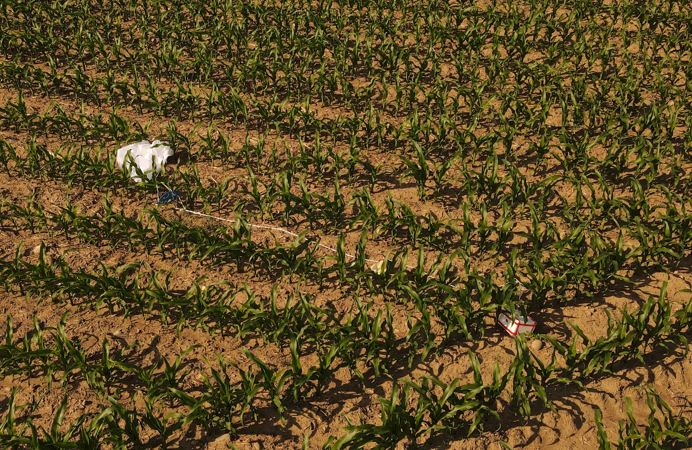

# Weather Balloon Tracker project

An amateur project of sending a weather balloon up to the sky. The balloon was successfully launched at more than 24km height and it was found after landing. The project was sponsored by Sii Poland company where I'm working at.

Project consists the balloon, landing parachute, air station inside the payload and Groung station:

The prepared payload as it was just before the launch:

1800mAh 3S Li-Poly battery was used to power the air station. An additional 1850 Samsung battery was used to power an action camera to ensure its long working time. Because of the low temperature at the high altitudes, Thermopaxx chemical warmers were used to heat the batteries. A foam container with a wall thickness of 2.5 cm was used as an enclosure.
The total weight of the payload was about 650g.

Signals from the air station were resieved in two ways: by the ground station and HabHub network. The ground station was saving each received packet into internal memory([Fly log](Doc/Fly_Chart.xlsx)). More technical details about the ground and air stations may be found in the subfolders(air station folder has the same name as the project).
Thanks to the logging we can see how the temperature was changing outside and inside the payload during the flight:

Also we can see the pressure change:

The payload was found at a distance of 104 km from the starting point:

