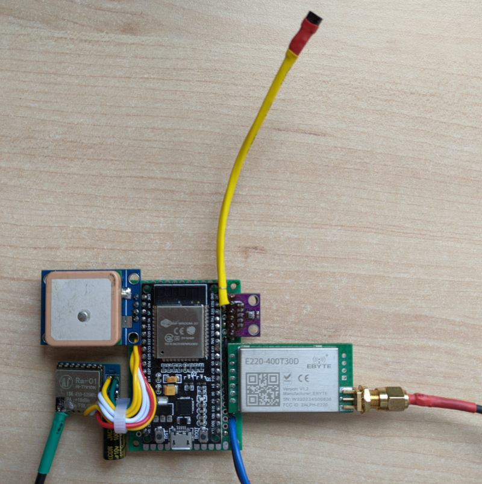
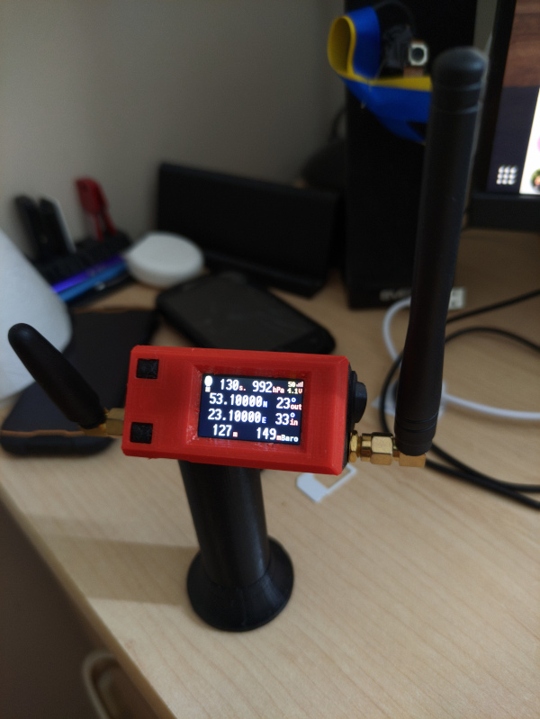

# Weather Balloon Tracker project

An amateur project of sending a weather balloon up to the sky. The balloon was successfully launched at more than 24km height and was found after landing. The project was sponsored by SII Poland company where I'm working at.

Project consists the balloon, landing parachute, Air and Groung stations:

***

The air station includes an internal temperature and pressure sensor(BMP280) and an external temperatute sensor(DS18B20) connected by I2C and 1-Wire interfaces to the main controller(ESP32). Position of the balloon received from GPS module(NEO-6M) via UART interface.
Telemetry delivered in two ways: 
* By RTTY transmission to HabHub high altitude balloons tracking system at 437.600MHz. During the launch about 5 HabHub stations were receiving the signal and sending the data to tracker.habhub.org website. Ra-01 SX1278 module is used for this purpose.
* By LoRa transmission to the ground station at 434.125MHz. The ground station displays the current position, temperature, altitude and saves historical data to internal memory. 433T30D (SX1278 + mcu and amplifier) module is used for LoRa transmission.

***

The ground station is based on TTGO T-Display RP2040 board, programmed with embedded Python and powered by a single 18650 Li-pol battery. Ground station's LoRa receiver module (433T30D) is also based on SX1278 and communicates with the controller by UART. Initially it was planned to add a GSM module to the ground station, but GSM created some interferences with RP2040 that caused its reset. The front panel of the station was taken from https://www.thingiverse.com/thing:4501444 and the main body with the battery bay was created in FreeCAD (sources and models are in GroundStation/Case folder).

